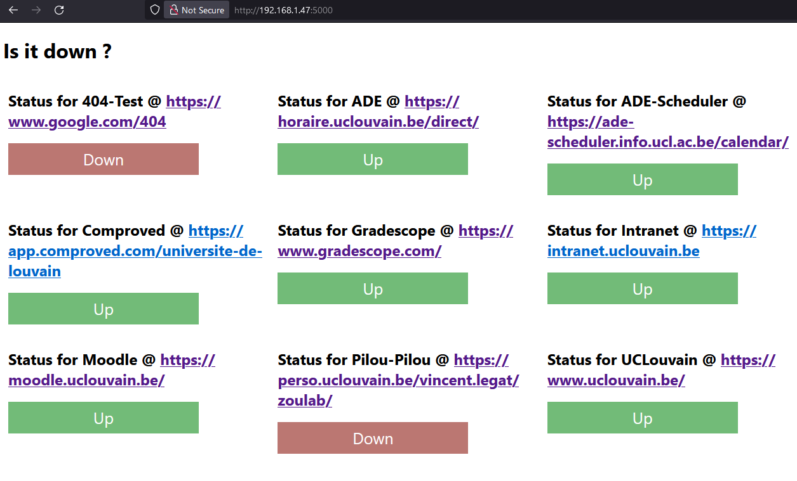

# UCLouvain website DownDetector

- [UCLouvain website DownDetector](#uclouvain-website-downdetector)
  - [Introduction](#introduction)
  - [How does it work ?](#how-does-it-work-)
  - [Roadmap](#roadmap)
  - [License](#license)

## Introduction

This website is displaying which website or service related to the UCLouvain is down at the moment.

You can find the list of all currently track services in this [json](services.json).

## How does it work ?

Here is the control panel where every website is displayed.

I am using Flask to run the website and handle all interaction between the user and the website.

To know if a service is down simply go to the `/<service>` on the website.

I am tracking and storing the last status in the JSON and only doing request every 5 minutes.

## Roadmap

- [x] Working pages
- [x] Home Page with links to other subpages
- [ ] A nice and clear home page with all current status
- [ ] Deployed locally
- [ ] Deployed globally 

## License

This work is protected under the [CC BY-NC-SA 4.0](https://creativecommons.org/licenses/by-nc-sa/4.0/). For the favicon, I used the UCLouvain's logo and 2 images that doesn't belong to me but to their rightful owner (*Check compliance with the license*).