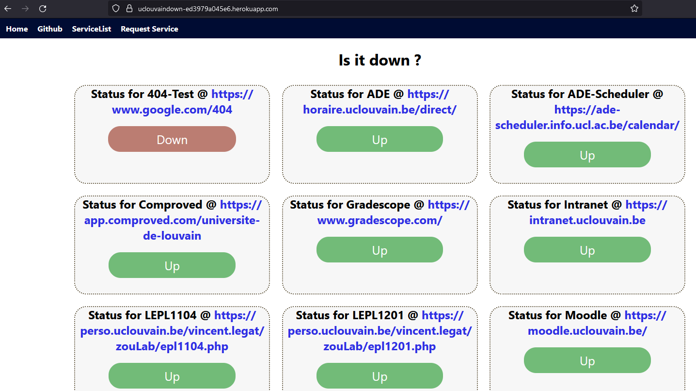

# UCLatence website DownDetector

- [UCLatence website DownDetector](#uclatence-website-downdetector)
  - [Introduction](#introduction)
  - [How does it work ?](#how-does-it-work-)
  - [How to run it ?](#how-to-run-it-)
    - [Explanation of the steps](#explanation-of-the-steps)
  - [Roadmap](#roadmap)
    - [API](#api)
  - [Documentation](#documentation)
  - [Translation](#translation)
  - [License](#license)

Test the app [here](https://uclatence.onrender.com/)

## Introduction

This website is displaying which website or service related to the UCLouvain is down at the moment.

You can find the list of all currently track services in this [json](services.json).

## How does it work ?

Here is the control panel where every website is displayed.

I am using Flask to run the website and handle all interaction between the user and the website.

To know if a service is down simply go to the `/<service>` on the website.

I am tracking and storing the last status in the JSON and only doing request every 5 minutes.

## How to run it ?

First, you need to use **python 3.11** version (we suggest you to use a virtual environnement).

1. `git clone git@github.com:Tfloow/UCLouvainDown.git` (*or fork it*)
2. `pip install -r requirements.txt`
3. `python app.py`

### Explanation of the steps

1. Clone the repo so you can get the code
2. In the main directory, install all needed dependencies and the correct version without hassle in one command
3. Run the app. It will host locally on your pc.c

## Roadmap

- [ ] Proper database
- [ ] Deploy cleaner Graph with the help of a JS library or framework
  
### API

- [ ] RSS

## Documentation

You can find the documentation and have a better understanding of what is going under the hood by reading [this](doc/doc.md). (*Please, open an issue with the tag "doc" to add any comments or when you need more information about a specific point of the doc*).

## Translation

This website is currently translated in English and French. We welcome any new translations !

Check [this document](/translations/contribue.md) to see how you can contribute to the project.

## License

This work is protected under the [CC BY-NC-SA 4.0](https://creativecommons.org/licenses/by-nc-sa/4.0/).