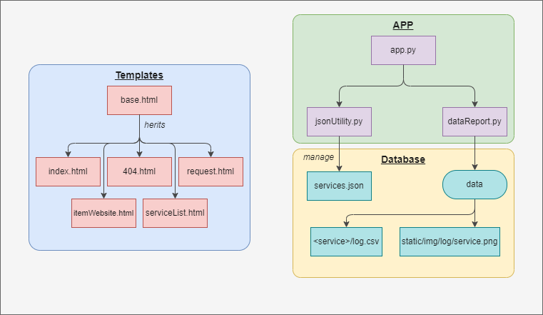

# Documentation of UCLouvain Down 

- [Documentation of UCLouvain Down](#documentation-of-uclouvain-down)
  - [Introduction](#introduction)
  - [Overview](#overview)
    - [Backend:](#backend)
    - [Frontend:](#frontend)
    - [Summary](#summary)


## Introduction

This website runs with Flask and the server with gunicorn. The site is hosted at heroku.

## Overview

### Backend:
- `app.py`: this where the main app is located and the website's brain
- `jsonUtility.py`: this is a python script with handy function to handle JSON and more specifically the `services.json`. It helps us updating the status, remember when the last check was done, add new services, ...
- `dataReport.py`: this python script handle the user's report of website. It handle the interactivity with the user when they want to report an outage. It will log the report into a csv and plot it. 
### Frontend:

#### `templates/`
We are taking advantage of Flask and jinja syntax to avoid boilerplate code. We have a `base.html` that have the base of our website such as a header, footer, ...

We then extend this baseline to tailor specific webpages for the need. When we extend this, we can provide 3 new block of html code:
1. `header`: we can change what's inside the `<head>` tag
2. `content`: we can add our content between the footer and header
3. `script`: we can add javascript scripts inside our html or add a `<link>` to a script (see [*static*](#static))

#### `static/`

This where we store all of the content required to build a new webpage. This follows the Flask guidelines.

You can find various *stylesheet* with the name looking like `style<Name-of-Template>.css` so it is easy to see what css goes with which page.

There is also some `robots.txt` and `sitemap.xml` for SEO purposes.

There is various folder:
- `ico/`: where we store the favicon for the webpages
- `img/log/`: where we store the plot of the user's report of outages and will be displayed on each services pages.
- `script/`: where we store the few javascript we have.

#### `data/`

This part is where we store a sort "database" with all of the report of the user.

All of the folder's name correspond to a tracked service by UCLouvain down **besides** the `request/` which is a little bit different. This is where the result of the [request form](https://uclouvaindown-ed3979a045e6.herokuapp.com/request) is.

You can extract all of the logs to build something with by clicking the link under each graph. Or you can do curl command looking like :

```
curl https://uclouvaindown-ed3979a045e6.herokuapp.com/extract?get=<folder-name> -o log.csv
```

### Summary

